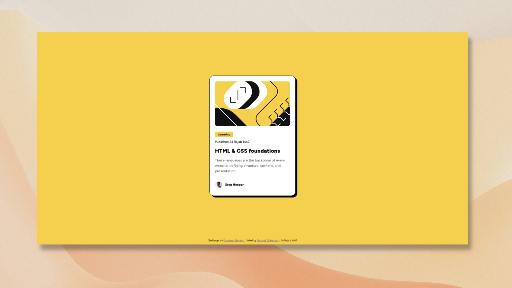

# Frontend Mentor - Blog preview card solution

This is a solution to the [Blog preview card challenge on Frontend Mentor](https://www.frontendmentor.io/challenges/blog-preview-card-ckPaj01IcS). Frontend Mentor challenges help you improve your coding skills by building realistic projects.

## Table of contents

- [Overview](#overview)
  - [The challenge](#the-challenge)
  - [Screenshot](#screenshot)
  - [Links](#links)
- [My process](#my-process)
  - [Built with](#built-with)
  - [What I learned](#what-i-learned)
- [Author](#author)
- [Attribution](#attribution)

## Overview

### The challenge

Users should be able to:

- See hover and focus states for all interactive elements on the page

### Screenshot



### Links

- Live Site URL: [Add live site URL here](https://youssef-el-atmani.github.io/blog-card/)

## My process

### Built with

- Semantic HTML5 markup
- CSS custom properties
- Flexbox

### What I learned

I learned working with downloaded fonts using `@font-face`:

```css
@font-face {
  font-family: "custom-name";
  src: url("url-here");
}
```

And I learned how to make a non-focusable elements focusable, using the `tabindex="0"` attribute.

## Author

- Frontend Mentor - [@youssef-el-atmani](https://www.frontendmentor.io/profile/youssef-el-atmani)
- X - [@shihaabyoussef](https://x.com/shihaabyoussef)
- Linkedin - [Youssef El Atmani](https://www.linkedin.com/in/youssef-el-atmani-432b663a4/)

## Attribution

The background image used in the [screenshot](#screenshot) is by [Pawel Czerwinski](https://unsplash.com/@pawel_czerwinski) on **Unsplash**.
